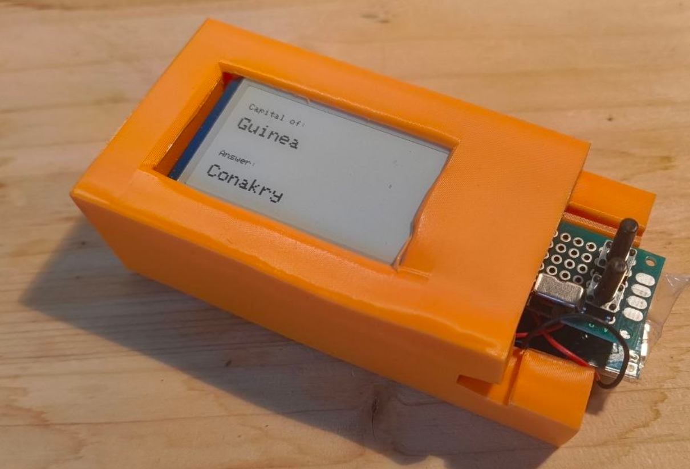

## Flash `main_213.cpp`

`src/main_213.cpp` is wired to the `proto_213` PlatformIO environment in [`platformio.ini`](/home/brokkoli/GITHUB/epaper-flashcard/platformio.ini:1).

1. Install PlatformIO Core if `pio` is not already available.
2. Connect the ESP8285/ESP8266 board over USB.
3. From the repo root, run:

```bash
pio run -e proto_213 -t upload
```

If you want to watch serial output after flashing, run:

```bash
pio device monitor -b 115200
```

Notes:

- `proto_213` builds only `src/main_213.cpp`.
- The project default environment is already `proto_213`, so `pio run -t upload` also works.
- `BUTTON_1_PIN` (`D3` / `GPIO0`) is a bootstrap pin. Do not hold it during reset or upload, or the ESP8266 may fail to boot/flash.

## Blink Test

To verify the ESP8285 itself without the display code, flash [`src/blink_8285.cpp`](/home/brokkoli/GITHUB/epaper-flashcard/src/blink_8285.cpp:1):

```bash
pio run -e blink_8285 -t upload
```

This target just toggles the onboard LED every 250ms.

## 2.13" Display Smoke Test

To verify the 2.13" panel with the minimum possible firmware, flash [`src/epd_213_smoke.cpp`](/home/brokkoli/GITHUB/epaper-flashcard/src/epd_213_smoke.cpp:1):

```bash
pio run -e epd_213_smoke -t upload
```

This target only initializes the display, does one full refresh, draws a simple black-and-white test pattern, and then idles.

## Scripts

- `154` and `213` refer to the epaper screen sizes (inch)

## Wiring
```
POWER
Battery + / board OUT+ -> toggle -> ESP VIN/5V or 3V3
Battery - / board GND  -> ESP GND
ESP 3V3                -> e-paper VCC
ESP GND                -> e-paper GND

E-PAPER
BUSY -> D0 / GPIO16
RST  -> D2 / GPIO4
DC   -> D1 / GPIO5
CS   -> D8 / GPIO15
CLK  -> D5 / GPIO14
DIN  -> D7 / GPIO13
GND  -> GND
VCC  -> 3V3

BUTTONS
Button 1: D3 / GPIO0  -> button -> GND
Button 2: D6 / GPIO12 -> button -> GND
```