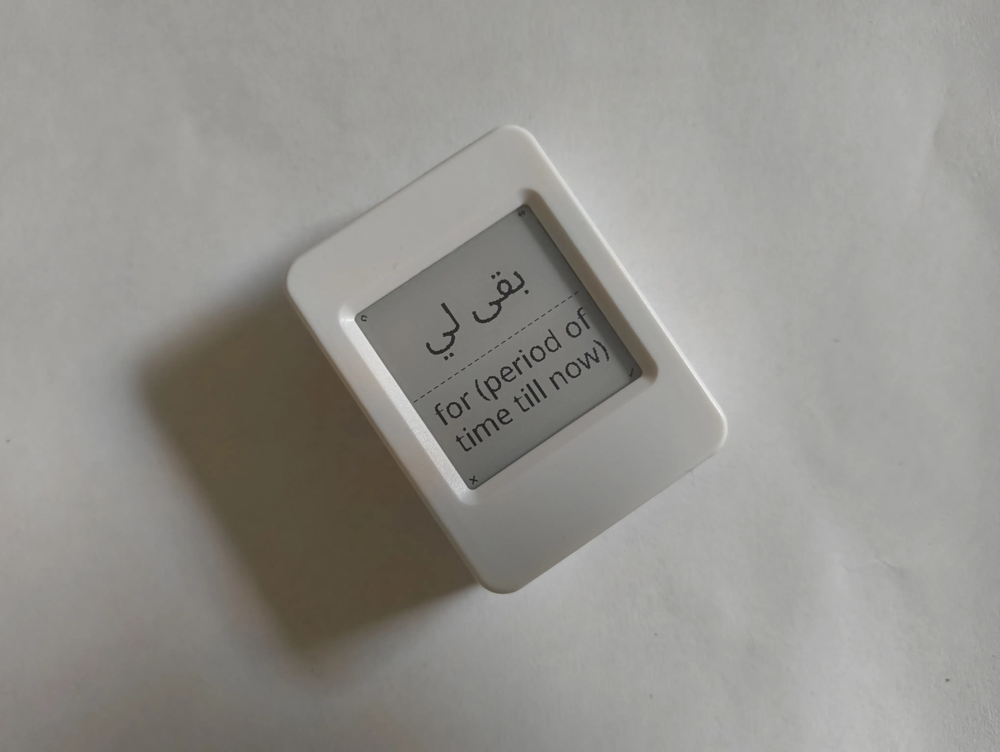

This folder is using the [Waveshare ESP32-S3-Touch-ePaper 1.54in black/white touch dev board](https://www.waveshare.com/esp32-s3-epaper-1.54.htm)




## build / flash

```
arduino-cli compile --fqbn "esp32:esp32:esp32s3:PSRAM=opi,PartitionScheme=default_8MB,FlashSize=8M,USBMode=hwcdc,CDCOnBoot=cdc" code/scripts/007_esp_s3_touch_flashcard_ble
arduino-cli upload  --fqbn "esp32:esp32:esp32s3:PSRAM=opi,PartitionScheme=default_8MB,FlashSize=8M,USBMode=hwcdc,CDCOnBoot=cdc" --port /dev/ttyACM0 code/scripts/007_esp_s3_touch_flashcard_ble
```

Board options must be set explicitly (OPI PSRAM, 8MB flash, 8MB-with-spiffs
partition scheme, and USB CDC serial output) — the generic
`esp32:esp32:esp32s3` FQBN's defaults are 4MB flash / no PSRAM and will
boot-loop on this board otherwise; its disabled CDC default also makes
`Serial` output invisible on the USB port.

### esp user doc

Screen: 8 px icon strip on top and bottom; between them the front of the card
(upper half) and the back (lower half, blank until revealed).

- **Reveal**: tap anywhere in the lower half. Then the left half of it is
  **wrong** and the right half **correct**.
- **Top-left icon** (reload): hard refresh — the only full-screen refresh in
  normal play; use it when partial-refresh ghosting gets annoying.
- **Top-right icon** (connect): enter sync mode (full refresh, "Sync Mode" +
  **Restart**). Open `sync.html`, connect to `Flashcards`, edit, save, then tap
  Restart.
- Long-press PWR shuts down from any screen. The power-off screen shows the
  welcome message (set on the manager's Settings page; stored as `/welcome.bin`
  on the SD) in its top 32 rows, then how many trials this session had and the
  card counts per box (at most 5 boxes) -- or a hint if nothing was practiced yet.

Card files are 200×92 bitmaps (`FC03`), carrying the card's last 32 correct/wrong
trials. Cards from older formats are skipped on load; clear them with the
manager's Delete-all and re-import.

Session stats live in `/sessions.bin` on the SD (one record per boot: graded
trials + the time the manager last synced). The manager sends the real time on
every connect and shows the history and stats page.
Icons live in `code/scripts/007_esp_s3_touch_flashcard_ble/icons/`; after
changing a PNG run `python3 icons/gen_icons.py` in that folder (needs Pillow)
to regenerate `icons.h`.
